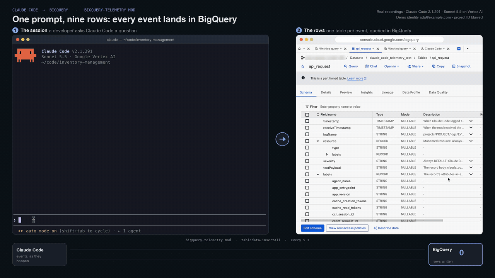
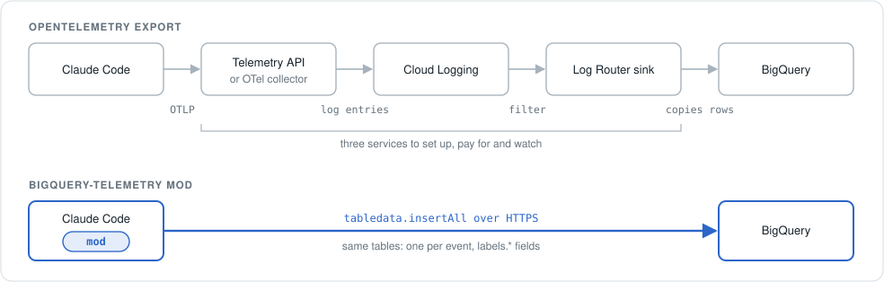
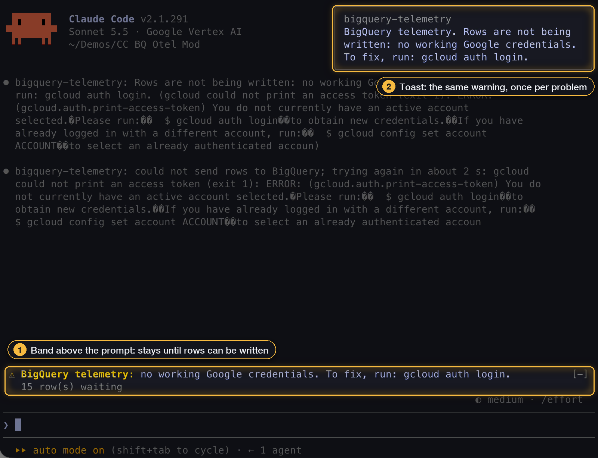

# Claude Code mod: telemetry straight to BigQuery

A Claude Code plugin whose [mod](https://code.claude.com/docs/en/plugins/mods/overview) copies each OpenTelemetry event record that reaches mods (`user_prompt`, `api_request`, `tool_decision`, `tool_result`, and so on) straight into BigQuery. There is no collector to deploy.



Exporting OpenTelemetry to BigQuery usually runs through Google's Telemetry API or a collector, Cloud Logging and a Log Router sink. The mod runs inside Claude Code and writes the same rows directly:

<picture>
  <source media="(prefers-color-scheme: dark)" srcset="assets/one-hop-dark.svg">
  
</picture>

The tables look like the ones a Cloud Logging sink writes to a BigQuery dataset with partitioned tables, when Claude Code's OpenTelemetry export reaches Cloud Logging through Google's Telemetry API (`telemetry.googleapis.com`). There is one table per kind of event, named for the bare event (`api_request`), partitioned by day on `timestamp`. Columns have the sink's camelCase names (`logName`, `textPayload`, `resource.labels.task_id`), and `labels` is a RECORD of STRING fields, so numbers need `SAFE_CAST`. See [What a row contains](#what-a-row-contains). `setup.sh` creates the tables and two views, `daily_spend` and `spend_by_model`, with the columns of the [`otel-bq` quickstart](../otel-bq/)'s views of those names.

## How this compares with OpenTelemetry export to Cloud Logging

| | This mod | OpenTelemetry export |
|---|---|---|
| What runs | A plugin on each developer's machine | Claude Code's OTLP exporter, sending to the Telemetry API directly or through a collector |
| Where events land | BigQuery tables you own, one per kind of event | Cloud Logging; a Log Router sink can copy them to BigQuery tables like these |
| Metrics (Cloud Monitoring) and traces | No. Token and cost totals come from `api_request` events. | Yes |
| Claude Code settings | None, beyond installing the plugin | `CLAUDE_CODE_ENABLE_TELEMETRY`, exporter endpoint, headers helper; `OTEL_RESOURCE_ATTRIBUTES` recommended |
| Claude Code version | 2.1.287 or later (mods) | Any version with OpenTelemetry support |
| Delivery | Best effort: rows can arrive twice or be lost (see [Limitations](#limitations)) | The OpenTelemetry SDK's batching, and the collector's if there is one |

Both can run at once: the mod passes every record on unchanged, so an OpenTelemetry export you already have keeps working.

```text
Claude Code ──telemetry.log──> mod (queue, batch every 5 s) ──insertAll over HTTPS──> one BigQuery table per event
     │                                                                                 (api_request, tool_result, …)
     └── the same record, unchanged, to your own OpenTelemetry export (if any)                │
                                                                                               ├── daily_spend
                                                                                               └── spend_by_model
```

## Requirements

- Claude Code 2.1.287 or later. Tested in the terminal CLI with `claude -p`; the Agent SDK runs the same CLI and should behave the same, but wasn't tested.
- A Google Cloud project with the BigQuery API and billing enabled (streaming inserts aren't in BigQuery's free tier).
- For setup, the `bq` CLI and `jq`. On each developer machine, `gcloud` signed in (see [Authentication](#authentication)).

## 1. Create the tables and views

```bash
PROJECT=your-project-id ./setup.sh
```

This creates, in `PROJECT`:

- the dataset `claude_code_telemetry` (change with `BQ_DATASET`), holding one table per kind of event that Claude Code's [monitoring documentation](https://code.claude.com/docs/en/monitoring-usage#events) lists. Each table has the columns in [`schema.json`](./schema.json), plus one `labels` field for each attribute that documentation lists for that event or for every event (and a few Claude Code is known to send anyway), as kept in [`event-labels.json`](./event-labels.json), and for each `EXTRA_LABELS` key. Tables are partitioned by day on `timestamp`.
- the dataset `claude_code_telemetry_reporting` (change with `VIEWS_DATASET`), holding the views `daily_spend` and `spend_by_model` ([`sql/`](./sql/)), which read the `api_request` table (see [The spend views](#the-spend-views)).

Other settings:

- `BQ_LOCATION` sets the location (default `US`).
- `TABLE_PREFIX` is added to the front of every table name. Set the mod's `table_prefix` option to the same value.
- `EXTRA_LABELS` is a comma-separated list of attribute names to give their own field in every table, for example `EXTRA_LABELS=cloud.region,team.id`. Attributes without their own field still arrive, in `labels.extra_labels` (see [Labels with no field](#labels-with-no-field)); a field of its own just makes one easier to query.

The script is safe to re-run. It creates what is missing, adds label fields an existing table lacks, and replaces the views; it never removes anything. Re-run it after adding an `EXTRA_LABELS` key. BigQuery's streaming inserts can take a few minutes to see fields added to an existing table, and until then they drop values for those fields without an error.

## 2. Let developers write rows

The mod reads each table's columns with `tables.get`, then streams rows with [`tabledata.insertAll`](https://cloud.google.com/bigquery/docs/reference/rest/v2/tabledata/insertAll). Writers need `bigquery.tables.get` and `bigquery.tables.updateData` on every table. Google's page also lists `bigquery.datasets.get`. The mod never creates or changes a table.

BigQuery Data Editor on the dataset would work, but it also lets every developer read everyone's rows and change or delete the tables. A narrower choice is a custom role with just the two table permissions, granted on the dataset to a group. None of this section was tested, so check the role before relying on it:

```bash
gcloud iam roles create claudeCodeTelemetryWriter --project=your-project-id \
  --title="Claude Code telemetry writer" \
  --permissions=bigquery.tables.updateData,bigquery.tables.get

bq add-iam-policy-binding \
  --member=group:claude-code-users@example.com \
  --role=projects/your-project-id/roles/claudeCodeTelemetryWriter \
  your-project-id:claude_code_telemetry
```

If inserts then fail with a permission error naming `bigquery.datasets.get`, also grant that permission on the dataset.

With this role writers can add rows and read table schemas, but can't read any rows, nor reach the views. Rows are written by the developer's own machine, so anyone who can write can also write rows with made-up values, such as another person's `user.email` or a wrong `cost_usd`. The same is true of OpenTelemetry export, where each machine sets `OTEL_RESOURCE_ATTRIBUTES`.

People who read the views need BigQuery Data Viewer on both datasets and BigQuery Job User on a project. To let them read the views without reading the tables, make the views [authorized views](https://cloud.google.com/bigquery/docs/authorized-views) of the tables' dataset.

## 3. Install and configure the plugin

The plugin's options go under `pluginConfigs` in user or managed settings. Claude Code does not read them from a repository's project settings.

### Try it on one machine

Load the folder directly and put the options in `~/.claude/settings.json`, under the id `bigquery-telemetry@inline`:

```json
{
  "pluginConfigs": {
    "bigquery-telemetry@inline": {
      "options": { "project": "your-project-id" }
    }
  }
}
```

```bash
claude --plugin-dir ./01-quickstart/bigquery-mod
```

### Roll it out with managed settings

Add the folder to a [plugin marketplace](https://code.claude.com/docs/en/plugins/create-marketplace) your organization controls, for example by copying it to `plugins/bigquery-telemetry` in your marketplace repository and listing it in `.claude-plugin/marketplace.json`:

```json
{ "name": "bigquery-telemetry", "source": "./plugins/bigquery-telemetry", "description": "Claude Code telemetry to BigQuery" }
```

Then install it and set its options for everyone in [managed settings](https://code.claude.com/docs/en/plugins/org):

```json
{
  "extraKnownMarketplaces": {
    "your-marketplace": { "source": { "source": "github", "repo": "your-org/your-marketplace" } }
  },
  "enabledPlugins": { "bigquery-telemetry@your-marketplace": true },
  "pluginConfigs": {
    "bigquery-telemetry@your-marketplace": {
      "options": { "project": "your-project-id", "dataset": "claude_code_telemetry" }
    }
  }
}
```

Two things to know:

- **`claude -p` and CI**: marketplace plugins install in the background, so the first run can start without the mod. Set `CLAUDE_CODE_SYNC_PLUGIN_INSTALL=1` to make the run wait for the install.
- **Organizations that allow only their own mods** (`allowManagedModsOnly` on the built-in guard, or `allowManagedHooksOnly`): a plugin Claude Code copies from a GitHub, git, URL or npm marketplace counts as the user's and will not load. To count as the organization's, the marketplace must be a directory on each machine, named by absolute path in managed settings and listing the plugin by relative path, which device management has to put there. See [Install your organization's mods](https://code.claude.com/docs/en/plugins/mods/admin).

### Who and where each row comes from

Developers set nothing beyond the plugin. Each row gets:

- **The developer's email address** in `labels.user_email`: the account the mod's credentials belong to (see [The email address](#the-email-address)), unless the record already carries a `user.email`.
- **The project** in `logName` and `resource.labels.project_id`: the `project` option.
- **The machine** in `resource.labels.task_id`: its hostname, in a `generic_task` resource with `job` `claude-code`. See [The resource](#the-resource).

`OTEL_RESOURCE_ATTRIBUTES` is optional. Claude Code copies its keys onto every record, so they become labels, and a few keys fill resource labels (see [The resource](#the-resource)).

### Options

| Option | Default | What it does |
|---|---|---|
| `project` | (none; required) | Project that holds the dataset |
| `dataset` | `claude_code_telemetry` | Dataset that holds the tables, one per kind of event |
| `table_prefix` | (none) | Added to the front of every table name, for example to keep these tables apart from others in a shared dataset. Use the same value as `TABLE_PREFIX` in `setup.sh`. A Cloud Logging sink adds no prefix, so queries written for sink tables need it added. |
| `email_from_credentials` | `true` | Fill `labels.user_email`, on records that carry no `user.email`, with the email address of the account the mod's credentials belong to (see [The email address](#the-email-address)). Set to `false` to send no address the record doesn't carry. |
| `hostname_task_id` | `true` | Put the machine's hostname in `resource.labels.task_id` (see [The resource](#the-resource)). Set to `false` to leave `task_id` empty and never look up the hostname. A `service.instance.id` you set in `OTEL_RESOURCE_ATTRIBUTES` is still used. |
| `auth` | `adc` | How the mod gets a Google access token; see [Authentication](#authentication) |
| `on_auth_failure` | `warn` | `warn` shows a warning above the prompt while rows can't be written for lack of credentials or permission; `block` also refuses prompts while there are no working credentials. See [When credentials fail](#when-credentials-fail) |
| `quota_project` | (none) | Sent as the `x-goog-user-project` header, for user credentials that need a quota project |
| `flush_interval_seconds` | `5` | How often queued rows are sent (1 to 300) |
| `api_base` | `https://bigquery.googleapis.com` | Change only to point the mod at a test server, with `auth: none` |

## 4. Check that rows arrive

Start a session, send a prompt, and within a few seconds:

```sql
SELECT logName, resource.type, resource.labels.task_id, COUNT(*) AS n
FROM `your-project-id.claude_code_telemetry.api_request`
WHERE timestamp > TIMESTAMP_SUB(CURRENT_TIMESTAMP(), INTERVAL 1 HOUR)
GROUP BY 1, 2, 3;
```

If nothing arrives, start Claude Code with `--debug` and search the debug log for `bigquery-telemetry`. Every problem the mod hits (no `project` set, a failed token command, a refused row, a missing table, a label with no field) is logged there, and in an interactive session the first occurrence of most of them also shows as a dim line in the transcript.

## Authentication

Claude Code gives mods no Google credential, so the mod gets its own access token, and sends it only to `https://*.googleapis.com`:

- **`adc`** (default): runs `gcloud auth application-default print-access-token`. Works on a laptop after `gcloud auth application-default login`, which Vertex AI users of Claude Code usually have done.
- **`gcloud`**: runs `gcloud auth print-access-token`, the account `gcloud` itself is signed in as.
- **`metadata`**: asks the metadata server for the attached service account's token. Use it on Compute Engine, Cloud Workstations, GKE with Workload Identity, or Cloud Run.
- **`none`**: sends no token, for a local test server only.

The mod gets a token when the session starts, so that one is at hand at exit, reuses a `gcloud` token for up to 10 minutes, and gets a new one when BigQuery answers 401. If BigQuery rejects the new token too, the rows wait and are retried with backoff; they aren't dropped.

### When credentials fail

Access tokens last about an hour and `gcloud` renews them on its own, so nothing happens day to day. Rows stop being written when the developer has never signed in, the sign-in was revoked or expired under the organization's re-authentication policy, BigQuery rejects the credentials (401), or the writer lacks permission (403). The mod then keeps the rows and retries (see [Limitations](#limitations)), and:

- **`warn`** (default): a line above the prompt says what's wrong and how to fix it, for example `run: gcloud auth application-default login`, with the number of rows waiting; a toast announces it once. It clears itself once a send succeeds: after signing in, including from the same session (for example `! gcloud auth application-default login`), that's with the next prompt, or within 30 seconds. With `claude -p` and the Agent SDK there is no band; the message goes to the debug log.
- **`block`**: as `warn`, and while there are no working credentials each prompt is refused with that message before it reaches the model, in interactive sessions and `claude -p` alike. Each prompt checks again, so signing in unblocks the next one. A missing permission (403) only warns, so that one wrong IAM grant can't stop every developer. If the mod can't send at all (bad options, outbound requests refused), prompts are refused too. The check fails closed: if it crashes, or BigQuery rejected the credentials earlier and can't be reached to check them again, the prompt is refused. A network failure alone, with credentials that work, doesn't block.



`block` is only enforcement if developers can't remove the mod: install it through managed settings, and for organizations that allow only their own mods, from a managed local marketplace (see [Roll it out with managed settings](#roll-it-out-with-managed-settings)). It guarantees that rows are being written, not what they contain. Unattended runs need credentials that don't expire, such as `auth: metadata`.

### The email address

With `email_from_credentials` on (the default), the mod looks up, once per session, the email address of the account its token belongs to:

- **`adc`** and **`gcloud`**: it asks Google's [`tokeninfo`](https://developers.google.com/identity/sign-in/web/backend-auth#calling-the-tokeninfo-endpoint) endpoint, which returns the verified email of the token's account. `gcloud` tokens carry the email scope this needs by default; without it there is no address, and the debug log says so.
- **`metadata`**: it asks the metadata server for the attached service account's email address, so rows name the service account, not a person.
- **`none`**: no address.

The address fills `labels.user_email` only when the record has no `user.email` of its own (Claude Code sets one for users signed in to an Anthropic account). It is never saved to disk with unsent rows, so rows a later session sends on an earlier one's behalf go without it rather than with the wrong account's.

## What a row contains

Each row is a Cloud Logging [log entry](https://docs.cloud.google.com/logging/docs/reference/v2/rest/v2/LogEntry), mapped from the OpenTelemetry record [as the Telemetry API maps it](https://docs.cloud.google.com/stackdriver/docs/reference/telemetry/otlp-log-record-to-log-entry), in the table layout of a Cloud Logging sink that [routes logs to BigQuery](https://docs.cloud.google.com/logging/docs/export/bigquery) with partitioned tables. Queries written for such sink tables should run on these, apart from the [known differences](#known-differences).

There is one table per kind of event, named for the event (`api_request`, `tool_result`, …), with `table_prefix` in front if set.

| Column | Value |
|---|---|
| `timestamp` | When the event was logged. Tables are partitioned by day on it, so filter on it. |
| `receiveTimestamp` | When the mod received the event |
| `logName` | `projects/PROJECT/logs/EVENT`, for example `projects/my-project/logs/api_request` |
| `resource.type`, `resource.labels.*` | The [monitored resource](https://docs.cloud.google.com/logging/docs/api/v2/resource-list) that wrote the entry: always `generic_task`, naming the project and the machine. See [The resource](#the-resource). |
| `textPayload` | `claude_code.EVENT` |
| `labels.*` | The record's attributes as strings, one field each, named [as a sink names fields](https://docs.cloud.google.com/logging/docs/export/bigquery): `session.id` becomes `labels.session_id`. Numbers are text, so use `SAFE_CAST`. Attributes without a field of their own are in the JSON field `labels.extra_labels`. |
| `severity` | `DEFAULT` |
| `trace`, `spanId`, `traceSampled` | The trace the record belongs to, if any (see [`LogEntry`](https://docs.cloud.google.com/logging/docs/reference/v2/rest/v2/LogEntry)) |
| `insertId` | A random ID per record, the same when a send is retried |

### The resource

Every row's `resource` is a `generic_task`, the monitored resource type Cloud Logging uses for a process that isn't a VM or a container, with these labels:

| Label | Value |
|---|---|
| `project_id` | The `project` option |
| `job` | `claude-code`, or the value of `OTEL_SERVICE_NAME` |
| `task_id` | The machine's hostname, from the `hostname` command or else the `HOSTNAME` or `COMPUTERNAME` variable. A `service.instance.id` in `OTEL_RESOURCE_ATTRIBUTES` replaces it, and the mod then doesn't run `hostname`. Empty with `hostname_task_id` off. |
| `location` | A `location`, `cloud.availability_zone` or `cloud.region` key in `OTEL_RESOURCE_ATTRIBUTES` (the first one set), else empty |
| `namespace` | A `namespace` or `service.namespace` key in `OTEL_RESOURCE_ATTRIBUTES`, else empty |

A hostname can identify a person: on macOS the default hostname usually includes the owner's name, such as `Adas-MacBook-Pro`. If it shouldn't reach the tables, turn `hostname_task_id` off, or set `service.instance.id` in `OTEL_RESOURCE_ATTRIBUTES` to something else.

### Labels with no field

Each table has a field for every attribute Claude Code's documentation lists for that event, plus a few it's known to send anyway such as `ttft_ms` on `api_request` (all kept in [`event-labels.json`](./event-labels.json)), and for each `EXTRA_LABELS` key. Any other attribute goes into `labels.extra_labels`, a JSON field holding one object per row: keys from `OTEL_RESOURCE_ATTRIBUTES`, attributes a newer Claude Code adds, and attributes it sends but doesn't document for that event. Nothing needs listing in advance:

```sql
SELECT SAFE_CAST(STRING(labels.extra_labels.history_entries_pruned) AS INT64) AS history_entries_pruned
FROM `your-project-id.claude_code_telemetry.retention_sweep`
```

Field access (`labels.extra_labels.team_id`) returns JSON; `STRING(...)` or `JSON_VALUE(labels.extra_labels, '$.team_id')` gives text. Keys are the field names a sink would use (`team.id` becomes `team_id`). Tables made by an earlier `setup.sh` may have `extra_labels` as a STRING, which BigQuery can't convert; read those with `JSON_VALUE`. To give an attribute its own field, add it to `EXTRA_LABELS` and run `setup.sh` again. A kind of event with no table at all is dropped, and the mod says so in the transcript; add it to `event-labels.json` and run `setup.sh`.

### The spend views

`daily_spend` and `spend_by_model` were written for this mod. They have the columns of the `otel-bq` quickstart's views of the same names, and read the `api_request` table, keeping one row per `insertId` and `timestamp` (see [Limitations](#limitations)). Each user is named by `labels.user_email`, or else (also when it is empty) as `id:` followed by the anonymous `labels.user_id`.

On Vertex AI, Claude Code sends no email, so `daily_spend` shows the address the mod takes from the credentials (see [The email address](#the-email-address)). With `auth: metadata` that is the service account's, and with `email_from_credentials` off or a token without the email scope, users show as `id:` and their `user.id`.

### Known differences

These tables weren't compared with ones a real sink wrote; they follow Google's documentation as linked above. The differences that are by design:

- **The resource is always `generic_task`.** A Telemetry API export picks the type from the resource attributes by [Google's table](https://docs.cloud.google.com/stackdriver/docs/reference/telemetry/otlp-attribute-to-logging-resource) (`generic_node`, `gce_instance`, `k8s_container`, …) and can take `project_id` from them. The mod always names the project from its options and the machine by hostname.
- **Tables and label fields exist before any row.** A sink creates a table on its first entry and adds a field when a label first appears; `setup.sh` creates them all up front, so most label fields are empty.
- **Only attributes in `event-labels.json` get their own field.** A sink adds a field for every label it sees, so an attribute missing from that list, such as `history_entries_pruned` on `retention_sweep`, becomes `labels.history_entries_pruned`. The mod can't add fields (writers may only insert rows), so such an attribute goes into [`labels.extra_labels`](#labels-with-no-field). A sink query that reads one, like `SAFE_CAST(labels.history_entries_pruned AS INT64)`, fails here; read it as `SAFE_CAST(STRING(labels.extra_labels.history_entries_pruned) AS INT64)`, or give it its own field with `EXTRA_LABELS=history_entries_pruned` and a `setup.sh` rerun. Rows written before the rerun keep the value in `extra_labels`.
- **`insertId` and `receiveTimestamp`** come from the mod, not from Cloud Logging.

## Limitations

- **Events only.** Claude Code's metrics (token, cost, session and lines-of-code counters) and traces don't pass through mods. Token and dollar totals can be rebuilt from `api_request` events, as the views do.
- **`cost_usd` is an estimate** Claude Code computes from list prices. It won't match a Google Cloud bill that includes discounts or commitments.
- **`CLAUDE_CODE_DISABLE_NONESSENTIAL_TRAFFIC` stops the mod.** While it is set, Claude Code refuses every network request a mod makes. The mod logs that it isn't sending. An organization policy that turns off web fetch has the same effect; `DISABLE_TELEMETRY` doesn't.
- **Records at the edges of a session can be missed.** Records logged before mods load never reach the mod (`plugin_loaded` sometimes does, sometimes doesn't). At exit the mod saves unsent rows and tries to send them for up to a second; whatever doesn't go out is sent by the next session on that machine. A session killed outright, or a restart of the mod, loses the rows queued since the last send (every 5 seconds by default).
- **Duplicates are possible.** A send that BigQuery stored but whose answer was lost is sent again, and two sessions can pick up the same saved rows. BigQuery drops repeats of an `insertId` on a best-effort basis only, so the spend views keep one row per `insertId` and `timestamp`; do the same in your own queries when exact counts matter.
- **Some rows are dropped.** A lasting error, such as a missing table or a malformed row, drops the batch and logs the reason, rather than retrying forever. So does a record over 256 KiB, Cloud Logging's limit for one entry. Server errors, rate limits, rejected credentials, missing permissions (403) and network failures are retried with backoff, and up to 16 MiB of rows wait in memory meanwhile.
- **Prompts and other content reach the tables if the OpenTelemetry switches say so.** `OTEL_LOG_USER_PROMPTS`, `OTEL_LOG_ASSISTANT_RESPONSES`, `OTEL_LOG_TOOL_DETAILS` and `OTEL_LOG_RAW_API_BODIES` add content to the records ([monitoring docs](https://code.claude.com/docs/en/monitoring-usage)), and the mod copies records as they are, even with no exporter configured. Leave them unset unless the tables should hold that content. Each value is cut at 64 KiB, as in Cloud Logging. A mod that redacts records must [run before this one](https://code.claude.com/docs/en/plugins/mods/events#the-order-mods-run-in).
- **Not tested in the Desktop app.** Claude Code's types mark `$.process` (which runs `gcloud` and `hostname`) as CLI only, so the `adc` and `gcloud` auth modes may not work there, and the hostname would come from the environment, if at all.

## Security notes

- Mods aren't sandboxed. This one and the commands it runs have the user's permissions. `claude plugin validate ./01-quickstart/bigquery-mod` lists every call it makes and every environment variable it reads. The calls that reach outside Claude Code are `$.http.fetch` (to BigQuery, to Google's `tokeninfo` endpoint for the email address, and to the metadata server with `auth: metadata`) and `$.process.run` (only `gcloud`, and `hostname` unless `hostname_task_id` is off or `OTEL_RESOURCE_ATTRIBUTES` sets `service.instance.id`).
- The mod sends its access token only to `https://*.googleapis.com`. Any other `api_base` requires `auth: none`; with any other `auth`, the mod refuses to start, and it also checks each request's address before attaching the token.
- It never refuses or changes a record, so it can't hide anything from another telemetry pipeline. With `on_auth_failure: block` it refuses prompts, never records, while credentials fail.
- By default each row carries the machine's hostname as `resource.labels.task_id` (see [The resource](#the-resource)) and the developer's email address as `labels.user_email` (see [The email address](#the-email-address)). Turn off `hostname_task_id` and `email_from_credentials` to leave them out.

## Tests

```bash
cd 01-quickstart/bigquery-mod
claude plugin test
```

The tests in [`tests/`](./tests/) check the row format (including table names, label field names and the resource), leaving out labels a table has no field for, batching per table, the handling of each kind of BigQuery answer, token refresh, and saving and resending rows at exit, with Claude Code's answers stubbed. They need no Google Cloud project or network, and need Claude Code 2.1.287 or later.

## Files

| File | What it is |
|---|---|
| [`.claude-plugin/plugin.json`](./.claude-plugin/plugin.json) | Plugin manifest and its options |
| [`hooks/register.mjs`](./hooks/register.mjs) | The mod: hooks, batching, sending, authentication, saving at exit |
| [`hooks/rows.mjs`](./hooks/rows.mjs) | Record-to-row mapping and BigQuery answer handling, with no Claude Code calls |
| [`schema.json`](./schema.json) | The columns every table has; `setup.sh` adds the label fields |
| [`event-labels.json`](./event-labels.json) | The attributes that get their own field: those Claude Code's documentation lists for every event and for each kind of event, plus a few it's known to send |
| [`setup.sh`](./setup.sh) | Creates the datasets, tables and views, and adds missing label fields |
| [`sql/`](./sql/) | The `daily_spend` and `spend_by_model` views |
| [`tests/`](./tests/) | `claude plugin test` tests |
