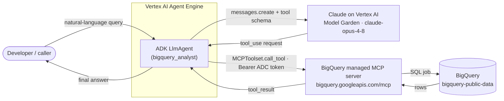

# MCP Integration — Google's Managed BigQuery MCP with Claude on Vertex AI

> ⚠️ **Use at your own risk.** See [root disclaimer](../../README.md).

## Overview

A hands-on tutorial for connecting Claude (served on Vertex AI) to Google's
**managed BigQuery MCP server**. It starts from the smallest pieces and builds
up to a deployable ADK agent.

**The key insight:** Anthropic's native MCP connector (the `mcp_servers`
parameter on the Messages API at `api.anthropic.com`) is **not available** when
Claude is served through Vertex AI via `AnthropicVertex`. The Vertex feature
list explicitly excludes agent infrastructure — *"Agent Skills, MCP connector,
programmatic tool calling."* So to use the managed BigQuery MCP server with
Claude-on-Vertex, you **bridge** it yourself: discover the server's tools,
expose them as Claude tool definitions, and drive the tool-call loop — by hand
(notebook 03), then declaratively with ADK (notebook 04).

## Prerequisites

- Completed [tool-use-with-claude](../tool-use-with-claude/).
- A Google Cloud project with billing enabled, and the `gcloud` CLI (written for
  Cloud Shell).
- The BigQuery API and Vertex AI API available in the project.
- Access to Claude models in the Vertex AI Model Garden for your project.
- Python 3.11+ and Application Default Credentials (`gcloud auth
  application-default login`).

## What You'll Learn

- Enable and reach the managed remote BigQuery MCP server, and authenticate to
  it with Application Default Credentials.
- Call Claude on Vertex AI with `AnthropicVertex`.
- Hand-roll the MCP↔Claude tool loop that the absent native connector would
  otherwise run for you.
- Package the result as an ADK agent and deploy it to Vertex AI Agent Engine.

The tutorial is four notebooks, smallest pieces first:

| Notebook | What it covers |
|---|---|
| [`01-setup.ipynb`](./01-setup.ipynb) | Enable the BigQuery API + MCP surface, set up ADC, and smoke-check that the MCP endpoint is reachable and Claude on Vertex responds. |
| [`02-mcp-and-vertex-pieces.ipynb`](./02-mcp-and-vertex-pieces.ipynb) | Prove each half in isolation: the raw MCP client against BigQuery, and `AnthropicVertex` against Claude. |
| [`03-manual-mcp-bridge.ipynb`](./03-manual-mcp-bridge.ipynb) | Hand-roll the MCP↔Claude tool loop and inspect the full trace. |
| [`04-adk-agent-engine.ipynb`](./04-adk-agent-engine.ipynb) | The same agent in ADK, run locally then deployed to Agent Engine. |

**Recommended order:** 01 → 02 → 03 → 04.

## Quick Start

```bash
cp .env.example .env
# edit .env: fill in GOOGLE_CLOUD_PROJECT and STAGING_BUCKET
pip install -r requirements.txt
gcloud auth application-default login
# then open 01-setup.ipynb
```

`.env` is gitignored and must never be committed. Public literals (the MCP
endpoint, the `bigquery-public-data` dataset) ship inline so the tutorial runs
out of the box; your project id, staging bucket, region, and model id come from
`.env`.

## Architecture



The request/response loop:

1. The caller sends a natural-language question to the agent.
2. The agent calls Claude on Vertex advertising the MCP tools, translated into
   Claude's tool-use schema.
3. Claude responds with a `tool_use` block naming a tool and its arguments.
4. The agent dispatches that call to the BigQuery MCP server over streamable
   HTTP, authenticating with an ADC bearer token (the server rejects API keys).
5. The MCP server runs the BigQuery job and returns the rows.
6. The agent appends the result as a `tool_result` and calls Claude again.
7. Steps 3–6 repeat until Claude stops requesting tools and returns an answer.

Notebook 03 implements steps 2–7 explicitly in `src/mcp_claude_bridge.py` — this
is what the absent native connector would otherwise do for you. Notebook 04
hands the same job to ADK: `MCPToolset` performs discovery and dispatch, and
`LlmAgent` runs the loop.

## Repository map

| Path | Purpose |
|---|---|
| `src/mcp_client.py` | Connect / list / call helpers for the BigQuery MCP server. |
| `src/mcp_claude_bridge.py` | Tool-schema translation and the manual tool loop. |
| `agent/agent.py` | ADK agent: Claude on Vertex + `MCPToolset`. |
| `deploy/deploy_agent_engine.py` | Deploy the ADK agent to Agent Engine. |
| `.env.example` | Template for required environment variables. |

## Gotchas

**The native MCP connector is not available on Vertex.** Anthropic's first-party
MCP connector runs the tool loop server-side at `api.anthropic.com`. The Vertex
feature list explicitly excludes agent infrastructure — *"Agent Skills, MCP
connector, programmatic tool calling"* (see [Claude on Vertex AI → Features not
supported](https://platform.claude.com/docs/en/build-with-claude/claude-on-vertex-ai)).
So through `AnthropicVertex` you must drive the loop yourself (notebook 03) or
let ADK drive it (notebook 04). This is the reason this tutorial exists.

**IAM roles for the BigQuery MCP server.** The server uses OAuth2/IAM and
**rejects API keys**. The calling identity needs `roles/bigquery.user`,
`roles/bigquery.dataViewer`, and `roles/mcp.toolUser`; enabling the MCP surface
also needs `roles/serviceusage.serviceUsageAdmin`. Programmatic auth is an ADC
bearer token from **`gcloud auth application-default print-access-token`** — note
the `application-default`: tool execution runs a BigQuery job server-side that
needs a cloud-platform-scoped token, so a plain `gcloud auth print-access-token`
can be accepted by the MCP gateway for metadata yet rejected by BigQuery with
HTTP 401. The token **expires (~1h)** — fine for the notebooks; for a long-lived
deployment, refresh it (via `httpx_client_factory`) or rely on the service
account identity.

**Claude region availability in Model Garden.** Claude availability varies by
region and requires enabling access in Model Garden. This tutorial uses the
**`global`** endpoint (`region="global"`) — dynamic routing, broadest
availability, no pricing premium. Regional/multi-region endpoints carry a
pricing premium (see [Vertex AI
pricing](https://cloud.google.com/vertex-ai/generative-ai/pricing)). Current
model ids carry no `@date` suffix (e.g. `claude-opus-4-8`).

**Data retention / ZDR.** Because you bridge MCP yourself, rows returned by
BigQuery come back as `tool_result` content and are sent to Claude **on Vertex**
as message content — governed by Vertex AI data governance (zero-data-retention
available); nothing transits Anthropic-hosted infrastructure. Vertex
request-response logging, if enabled, captures prompts and completions including
that tool data.

**ADK tool-search behavior.** `MCPToolset` fetches the **full** tool list from
the BigQuery MCP server at agent-init and exposes all of it to the model. Keep
the tool list small and read-only with `tool_filter=[...]`; on Agent Engine the
toolset must be built **synchronously** at import time in `agent.py` (an async
factory cannot be initialized during the build).

**Remote MCP from inside Agent Engine — the service-account identity is rejected
(HTTP 403).** Running this agent **locally** calls the remote BigQuery MCP server
end-to-end using your **end-user** ADC identity. Deployed to Agent Engine it runs
as the runtime **service account**, and live testing showed the model is reached
and emits correct tool calls, but every MCP call fails. ADK reports this as the
opaque *"MCP session connection lost"*; unwrapping the underlying `ExceptionGroup`
revealed the real error: **HTTP 403 Forbidden** from `bigquery.googleapis.com/mcp`.
It is a **403, not a 401** — the service-account token authenticates fine, but
the managed MCP server does **not authorize the service-account identity**, even
with `roles/mcp.toolUser` + BigQuery roles granted (verified, consistent across
redeploys, so not IAM propagation). This matches the server's user-OAuth /
consent design: it expects an **end-user (3-legged) identity**, not a service
account (2-legged). Workarounds: run the agent where it can carry a user identity
(e.g. Cloud Run with end-user credentials), use the in-process bridge from
notebook 03, or wait for service-account support on the managed server. The local
ADK path in this tutorial is verified working; treat the Agent Engine deploy here
as a structural reference.

## Cost Considerations

- Per-token billing for Claude on Vertex (the notebooks send tiny prompts).
- BigQuery query costs against `bigquery-public-data` (the sample queries scan
  little data).
- Agent Engine deployments are **billable for as long as they exist** — delete
  the resource when you finish (notebook 04 includes a cleanup cell).

## References

- [Model Context Protocol](https://modelcontextprotocol.io/)
- [Use the BigQuery MCP server](https://docs.cloud.google.com/bigquery/docs/use-bigquery-mcp)
- [Claude on Vertex AI](https://platform.claude.com/docs/en/build-with-claude/claude-on-vertex-ai)
- [Agent Development Kit (ADK)](https://google.github.io/adk-docs/)
